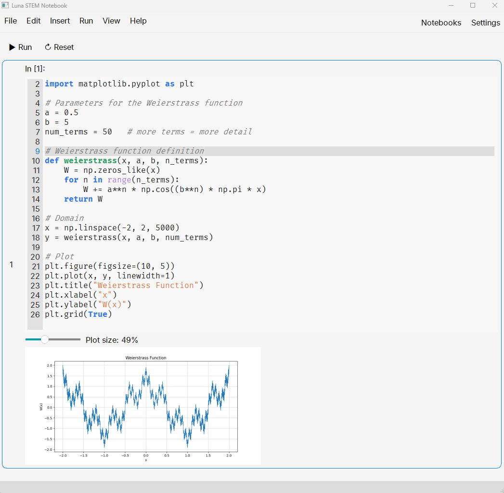
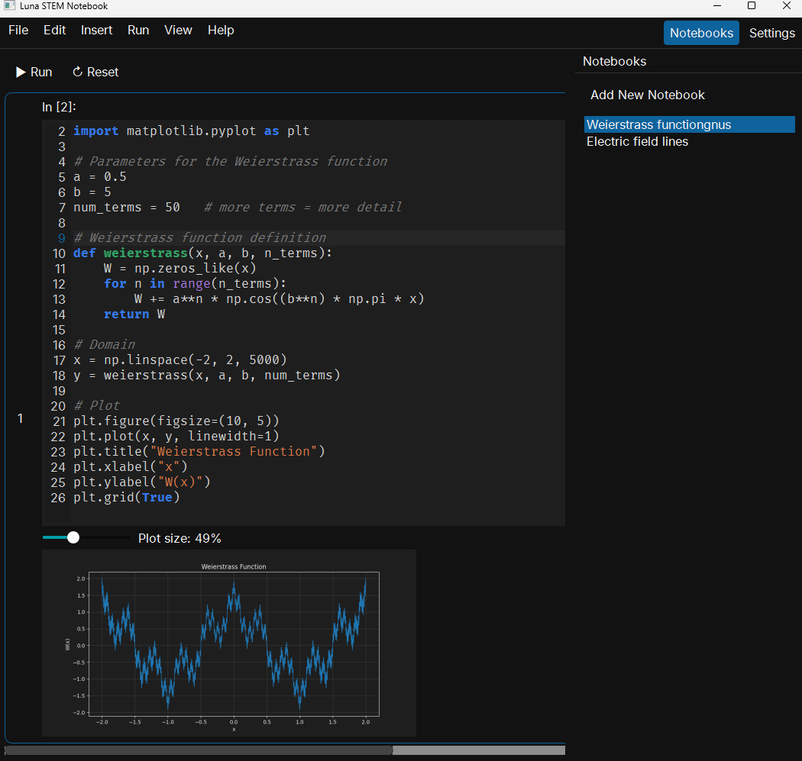
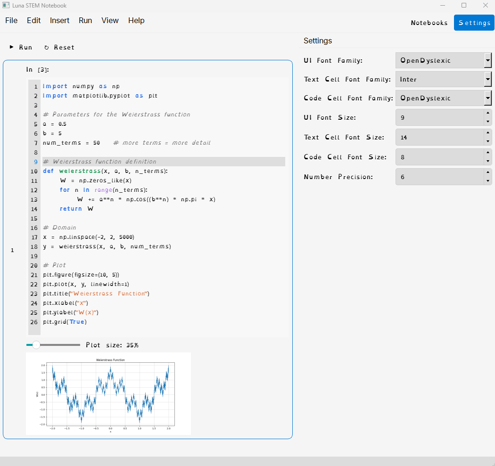

# LunaQt

Experimental attempt to build the Luna STEM Notebook in Python using Qt, aiming to leverage a unified Qt-based cross‑platform UI. Inspired by the UI and workflow philosophy of Euler Math Toolbox.

Status: experimental / work in progress.

## Screenshots

## Qt / PySide6

This project uses Qt via PySide6 (Qt for Python). PySide6 provides Python bindings for the Qt 6 widget toolkit, giving a modern, native-like, cross‑platform UI.

- UI toolkit: PySide6 (Qt 6)
- Plotting: matplotlib (for simple charts/visuals)
- Python: 3.10+ recommended

Why Qt/PySide6?
- Native widgets and high DPI support on Windows, macOS, and Linux
- Rich controls (tables, trees, dockable panels) and flexible layouts
- Mature designer tools and a large ecosystem
 - Rich text editing and Markdown support via Qt's QTextDocument/Markdown; live preview possible with Qt WebEngine
 - LaTeX math rendering via MathJax/KaTeX in a WebEngine view, or static rendering via matplotlib/QtSvg
 - Embeddable code editor widgets (QPlainTextEdit with syntax highlighting, or third‑party QScintilla/QCodeEditor)
 - Spreadsheet-like UIs via QTableWidget/QTableView (+ model/view), with sorting, editing, delegates. Or WebEngine view to host web grids (e.g., Handsontable) or use third‑party Qt components.
 - Interactive geometry cells via Qt WebEngine + JSXGraph for a GeoGebra‑like experience; offline‑friendly and can sync with Python via Qt WebChannel.

CAS options
- SymPy (pure‑Python CAS)
- GIAC/Xcas: Python bindings exist (e.g., giacpy/pygiac) and can be explored to integrate GIAC as the CAS backend.

## License

This project is licensed under the MIT License. See the `LICENSE` file for details.

See also: `THIRD_PARTY_NOTICES.md` for third‑party dependencies and licenses.
